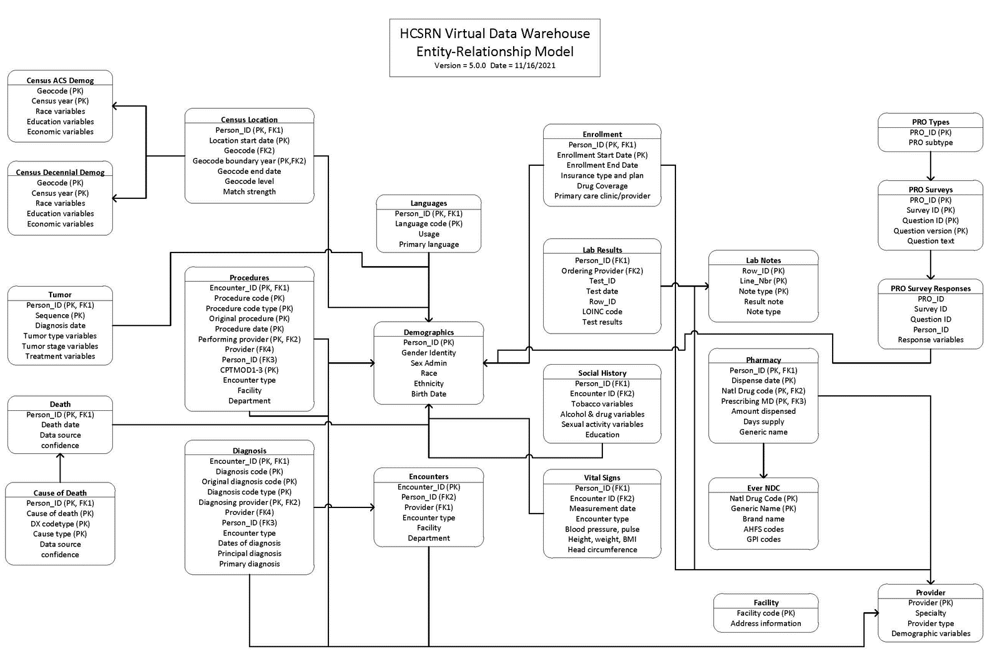

# HCSRN Virtual Data Warehouse Data Specifications

This repository is a proof-of-concept demonstrating what things would be like if we decided to host our data specifications for the <a href="https://hcsrn.org">Health Care Systems Research Network</a>'s Virtual Data Warehouse in a github repository.

## Tables

1. [Demographics](specs/_vdw_demographic.md)
1. Language
1. [Enrollment](specs/_vdw_enroll.md)
1. Encounter
1. Diagnosis
1. Procedure
1. Provider
1. Facility
1. Pharmacy
1. EverNDC
1. Lab Results
1. Lab Notes
1. Vital Signs
1. Social History
1. Death
1. Cause of Death
1. Tumor Registry
1. Census Location
1. Census Demographics
1. Census ACS Demographics
1. Census Decennial Demographics
1. PRO Types
1. PRO Surveys
1. PRO Survey Responses

## Entity-Relationship Diagram

