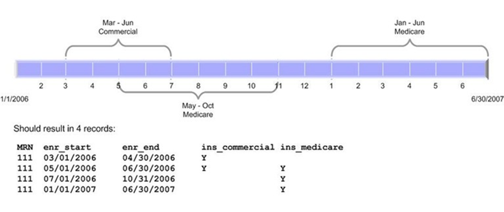

# ENROLLMENT
Version = 5.0.0  Date = 11/16/2021 StdVar = &\_vdw\_enroll

## Subject Area Description
The ENROLLMENT table contains periods of time during which we believe to have at least the partial capture of medical care information either because of enrollment in a health insurance plan that we know about or as a patient of a care delivery system that we own or interact with. Insurance coverage is not the only basis of data capture (see ENROLLMENT_BASIS) nor do all records necessarily indicate completeness of data capture (see the capture warning variables, which all begin with 'INCOMPLETE'). Each record represents a period of time during which the information on the included variables was true.  As many records as are necessary should be added to represent changes over time. There may be many contiguous records for a single period of enrollment, in order to account for these changes. However, periods may NOT overlap one another; there should be only one record covering any given day + medical record number. The following figure illustrates this concept:

| Variable Name          | Definition                                                                                                                                                                                                               | Type(Len) | Values                                                                                                                                                                        | Implementation Guidelines                                                                                                                                                                                                                                                                                                                                                                                                                                                                                                                                  |
| ---------------------- | ------------------------------------------------------------------------------------------------------------------------------------------------------------------------------------------------------------------------ | --------- | ----------------------------------------------------------------------------------------------------------------------------------------------------------------------------- | ---------------------------------------------------------------------------------------------------------------------------------------------------------------------------------------------------------------------------------------------------------------------------------------------------------------------------------------------------------------------------------------------------------------------------------------------------------------------------------------------------------------------------------------------------------- |
| MRN                    | Medical record number is the unique patient identifier within a site and should never leave the site                                                                                                                     | char(\*)  | Unique to each patient at each site                                                                                                                                           |                                                                                                                                                                                                                                                                                                                                                                                                                                                                                                                                                            |
| ENR\_START             | Beginning of the period at risk for medical care capture                                                                                                                                                                 | num(4)    | SAS Date                                                                                                                                                                      | Sites with exact date information on starts/stops should use them; those that do not should use the first and last days of the month. Periods that are ongoing at the time the file is created should bear the last day of known, actual enrollment at the time of the update. E.g. is source data is realtime, enr\_end would be set to &sysdate but is source data is updated weekly, enr\_end would be the last day of the week prior to the update. Discussion and code on how to implement non-overlapping periods is available on the HCSRN website. |
| ENR\_END               | End of the period at risk for medical care capture                                                                                                                                                                       | num(4)    | SAS Date                                                                                                                                                                      |
| INS\_MEDICAID          | Whether the person had any Medicaid insurance coverage during the period                                                                                                                                                 | char(1)   | Y = Yes E = Yes, but from an External organization N = No U = Unknown                                                                                                | See Appendix B for detailed descriptions of each insurance coverage.                                                                                                                                                                                                                                                                                                                                                                                                                                                                                       |
| INS\_COMMERCIAL        | Whether the person had any commercial insurance coverage during the period                                                                                                                                               | char(1)   | Y = Yes E = Yes, but from an External organization N = No U = Unknown                                                                                                | See Appendix B for detailed descriptions of each insurance coverage.                                                                                                                                                                                                                                                                                                                                                                                                                                                                                       |
| INS\_PRIVATEPAY        | Whether the person had any insurance coverage in a private pay plan during the period                                                                                                                                    | char(1)   | Y = Yes E = Yes, but from an External organization N = No U = Unknown                                                                                                | See Appendix B for detailed descriptions of each insurance coverage. Broadly defined as the individual bearing nearly all of the cost of the premium.                                                                                                                                                                                                                                                                                                                                                                                                      |
| INS\_STATESUBSIDIZED   | Whether the person had any state subsidized insurance coverage during the period                                                                                                                                         | char(1)   | Y = Yes E = Yes, but from an External organization N = No U = Unknown                                                                                                | See Appendix B for detailed descriptions of each insurance coverage. Typically covers lower income individuals who do not qualify for Medicaid.                                                                                                                                                                                                                                                                                                                                                                                                            |
| INS\_SELFFUNDED        | Whether the person had any insurance coverage through an employer group that insures itself during the period                                                                                                            | char(1)   | Y = Yes E = Yes, but from an External organization N = No U = Unknown                                                                                                | See Appendix B for detailed descriptions of each insurance coverage. Typically commercial employers who bear employee's medical risk. The HMO serves as a claims administrator.                                                                                                                                                                                                                                                                                                                                                                            |
| INS\_HIGHDEDUCTIBLE    | Whether the person had any insurance coverage in a high deductible plan during the period [as defined by the U.S. IRS (Pub 969) qualifying for a Health Savings Account](http://www.irs.gov/publications/p969/ar02.html) | char(1)   | Y = Yes E = Yes, but from an External organization N = No U = Unknown                                                                                                | See Appendix B for detailed descriptions of each insurance coverage.                                                                                                                                                                                                                                                                                                                                                                                                                                                                                       |
| INS\_MEDICARE          | Whether the person had any Medicare insurance coverage, including Medicare working aged, during the period                                                                                                               | char(1)   | Y = Yes E = Yes, but from an External organization N = No U = Unknown                                                                                                | See Appendix B for detailed descriptions of each insurance coverage. If any INS\_MEDICARE\_X variables are set to 'Y', this variable should also equal 'Y'.                                                                                                                                                                                                                                                                                                                                                                                                |
| INS\_MEDICARE\_A       | Whether the person had Medicare Part A insurance coverage during the period                                                                                                                                              | char(1)   | Y = Yes E = Yes, but from an External organization N = No U = Unknown                                                                                                | See Appendix B for detailed descriptions of each insurance coverage. Part A generally covers inpatient care.                                                                                                                                                                                                                                                                                                                                                                                                                                               |
| INS\_MEDICARE\_B       | Whether the person had Medicare Part B insurance coverage during the period                                                                                                                                              | char(1)   | Y = Yes E = Yes, but from an External organization N = No U = Unknown                                                                                                | See Appendix B for detailed descriptions of each insurance coverage. Part B generally covers outpatient care.                                                                                                                                                                                                                                                                                                                                                                                                                                              |
| INS\_MEDICARE\_C       | Whether the person had Medicare Part C insurance coverage during the period                                                                                                                                              | char(1)   | Y = Yes E = Yes, but from an External organization N = No U = Unknown                                                                                                | See Appendix B for detailed descriptions of each insurance coverage. Part C generally covers inpatient and outpatient but with capitated payment to the insurance provider.                                                                                                                                                                                                                                                                                                                                                                                |
| INS\_MEDICARE\_D       | Whether the person had Medicare Part D insurance coverage during the period                                                                                                                                              | char(1)   | Y = Yes E = Yes, but from an External organization N = No U = Unknown                                                                                                | See Appendix B for detailed descriptions of each insurance coverage. Part D generally covers prescriptions drugs.                                                                                                                                                                                                                                                                                                                                                                                                                                          |
| INS\_OTHER             | Whether the person had insurance coverage during the period that is not otherwise included in the INS\_\* variables during the period                                                                                    | char(1)   | Y = Yes E = Yes, but from an External organization N = No U = Unknown                                                                                                | See Appendix B for detailed descriptions of each insurance coverage. Any other insurance type not adequetely categorized by one of the other INS\_\* variables                                                                                                                                                                                                                                                                                                                                                                                             |
| PLAN\_HMO              | Whether the person had insurance coverage under an HMO plan during the period                                                                                                                                            | char(1)   | Y = Yes E = Yes, but from an External organization N = No U = Unknown                                                                                                | See Appendix B for detailed descriptions of each plan type.                                                                                                                                                                                                                                                                                                                                                                                                                                                                                                |
| PLAN\_POS              | Whether the person had insurance coverage in a point-of-service plan during the period                                                                                                                                   | char(1)   | Y = Yes E = Yes, but from an External organization N = No U = Unknown                                                                                                | See Appendix B for detailed descriptions of each plan type.                                                                                                                                                                                                                                                                                                                                                                                                                                                                                                |
| PLAN\_PPO              | Whether the person had insurance coverage in a preferred provider organization plan during the period                                                                                                                    | char(1)   | Y = Yes E = Yes, but from an External organization N = No U = Unknown                                                                                                | See Appendix B for detailed descriptions of each plan type.                                                                                                                                                                                                                                                                                                                                                                                                                                                                                                |
| PLAN\_INDEMNITY        | Whether the person had insurance coverage in a traditional indemnity plan during the period                                                                                                                              | char(1)   | Y = Yes E = Yes, but from an External organization N = No U = Unknown                                                                                                | See Appendix B for detailed descriptions of each plan type.                                                                                                                                                                                                                                                                                                                                                                                                                                                                                                |
| DRUGCOV                | Whether the person had any insurance coverage that included at least some coverage for prescription drugs                                                                                                                | char(1)   | Y = Yes E = Yes, but from an External organization N = No U = Unknown                                                                                                | If the member has any drug coverage, meaning that the insurer is at risk for any portion of the cost associated with drug dispensings, this should be coded as 'Y'. It should of course follow from this that coverage for any particular drug is not guaranteed.                                                                                                                                                                                                                                                                                          |
| INCOMPLETE\_OUTPT\_RX  | Is outpatient pharmacy fill data suspected to be incomplete for this person/period?                                                                                                                                      | char(1)   | K = There are known reasons to suspect incomplete capture N = No, there is no known reason to suspect incomplete capture X = This variable not implemented at this site | These vars must exist but substantive implementation is optional. See usage notes below.                                                                                                                                                                                                                                                                                                                                                                                                                                                                   |
| INCOMPLETE\_OUTPT\_ENC | Is outpatient encounter data suspected to be incomplete for this person/period?                                                                                                                                          | char(1)   | K = There are known reasons to suspect incomplete capture N = No, there is no known reason to suspect incomplete capture X = This variable not implemented at this site | These vars must exist but substantive implementation is optional. See usage notes below.                                                                                                                                                                                                                                                                                                                                                                                                                                                                   |
| INCOMPLETE\_INPT\_ENC  | Is inpatient encounter data suspected to be incomplete for this person/period?                                                                                                                                           | char(1)   | K = There are known reasons to suspect incomplete capture N = No, there is no known reason to suspect incomplete capture X = This variable not implemented at this site | These vars must exist but substantive implementation is optional. See usage notes below.                                                                                                                                                                                                                                                                                                                                                                                                                                                                   |
| INCOMPLETE\_EMR        | Is electronic medical record data (e.g. social history, vital signs) suspected to be incomplete for this person/period?                                                                                                  | char(1)   | K = There are known reasons to suspect incomplete capture N = No, there is no known reason to suspect incomplete capture X = This variable not implemented at this site | These vars must exist but substantive implementation is optional. See usage notes below.                                                                                                                                                                                                                                                                                                                                                                                                                                                                   |
| INCOMPLETE\_TUMOR      | Is tumor data suspected to be incomplete for this person/period?                                                                                                                                                         | char(1)   | K = There are known reasons to suspect incomplete capture N = No, there is no known reason to suspect incomplete capture X = This variable not implemented at this site | These vars must exist but substantive implementation is optional. See usage notes below.                                                                                                                                                                                                                                                                                                                                                                                                                                                                   |
| INCOMPLETE\_LAB        | Is lab results data suspected to be incomplete for this person/period?                                                                                                                                                   | char(1)   | K = There are known reasons to suspect incomplete capture N = No, there is no known reason to suspect incomplete capture X = This variable not implemented at this site | These vars must exist but substantive implementation is optional. See usage notes below.                                                                                                                                                                                                                                                                                                                                                                                                                                                                   |
| ENROLLMENT\_BASIS      | The basis for the claim that we have at least partial capture of the medical care information during the period. Historically 'I'nsurance was the only permissible basis                                                 | char(1)   | G = Geography I = Insurance B = Both geography & insurance P = Non-enrolled patient                                                                                  |                                                                                                                                                                                                                                                                                                                                                                                                                                                                                                                                                            |
| PCC                    | The primary care clinic to which the patient is paneled in administrative record.                                                                                                                                        | char(\*)  | Same value set as UTILIZATION.FACILITY\_CODE                                                                                                                                  |                                                                                                                                                                                                                                                                                                                                                                                                                                                                                                                                                            |
| PCP                    | The clinician to which the patient is paneled in administrative record                                                                                                                                                   | char(\*)  | Values link as a foreign key to UTILIZATION.PROVIDER                                                                                                                          |                                                                                                                                                                                                                                                                                                                                                                                                                                                                                                                                                            |

## Primary Key:
MRN + ENR_START (no overlapping time periods are permitted)

## Foreign Key Relationship:

## Usage Notes

### The Data Capture Variables

A '\[N\]o'value on the INCOMPLETE\_* variables is *not* an assertion that data capture is actually complete--it only signifies that there is no known reason for it to be *in*complete.  If an implementer has no reason to suspect that capture is especially suspect, they should use the \[N\]o value.  This is why there is no 'unknown' valid value defined—if you don't know of a specific, unusual reason that capture should be incomplete (like one of the examples listed below) you use \[N\]o. Examples of known deficits include:

  * Your organization offers a health plan in conjunction with a network of partner providers, creating a class of people for whom your organization is an insurer but not a health care provider.  People in these plans would likely have complete capture of encounters (via claims) but would not appear in EMR or Lab data.
  * Your research organization gets its Tumor data from a regional registrar, whose catchment area does not cover all of your enrollees/patients.  You can tell based on their county of residence whether tumors diagnosed in those people/periods should appear in your VDW Tumor data.

(Both of these examples are true at KP Washington.)

Users are advised to treat N and X values in the INCOMPLETE\_* variables as essentially identical in information content.  For applications that require, for example, complete Tumor data over time, we recommend using a condition like:  `WHERE incomplete_tumor ne "Y"`. When in doubt please check with your sites.

### Sites May Have Additional Variables

Many sites have added site-specific variables that are not a part of the specifications. At these sites, users may well find multiple records for contiguous time periods, over which none of the official specification variables change. Users will likely be interested in the `%CollapsePeriods` or enrollment-related macros for collapsing records in to continuous periods.

## Comments
